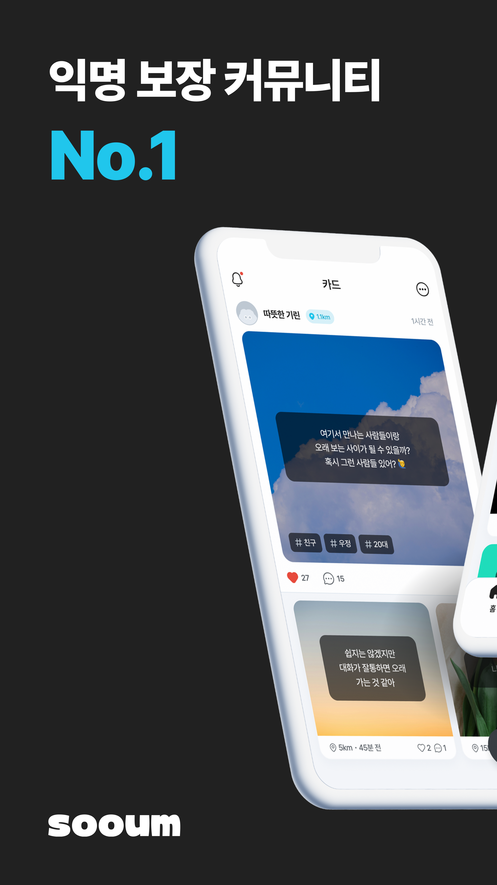
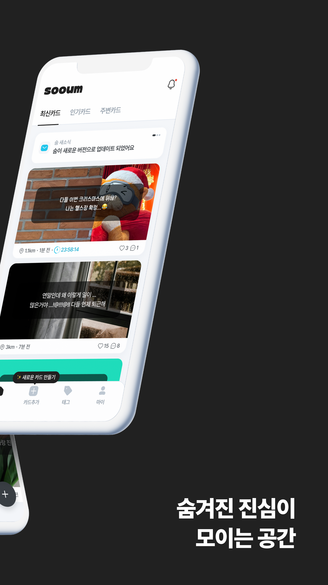
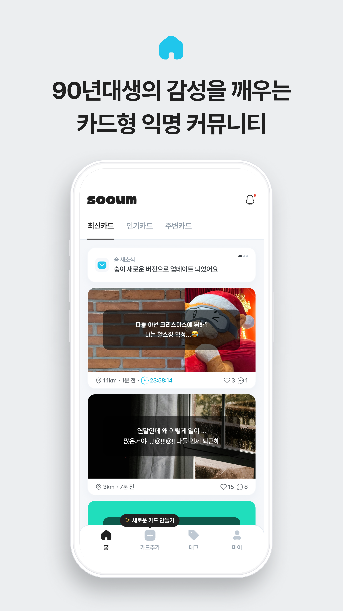
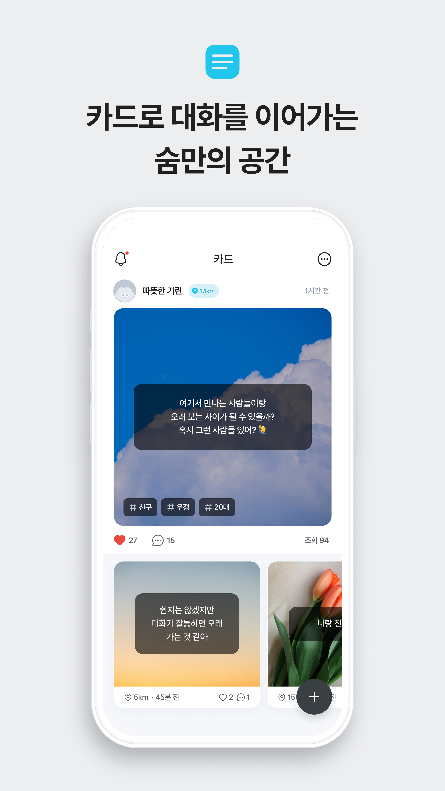
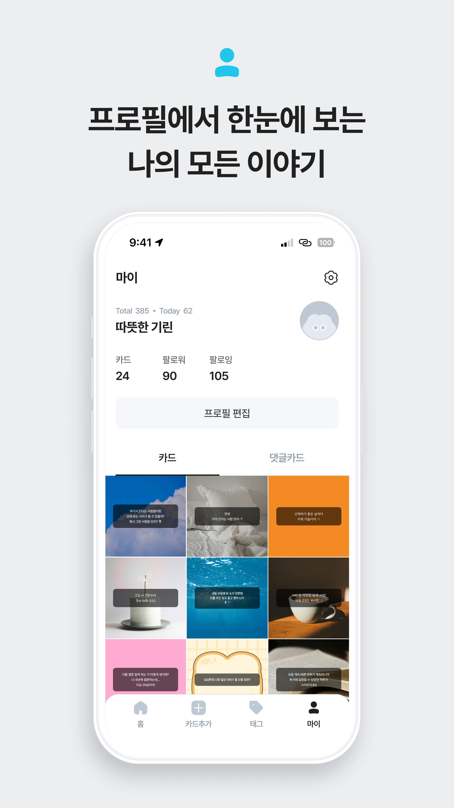
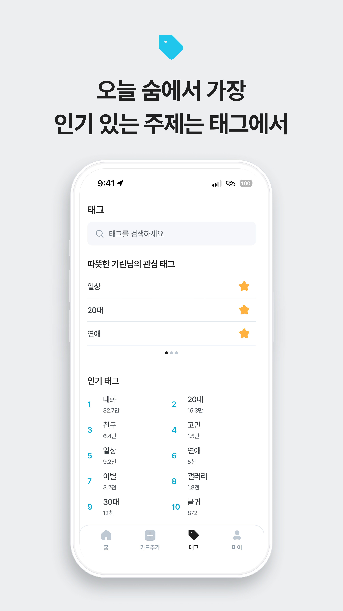

# 숨 (SOOUM) - Android

## About SOOUM
숨은 완전한 익명성을 보장하는 카드형 SNS 앱 서비스입니다.
사용자들이 자유롭게 생각을 공유할 수 있는 안전한 공간을 제공합니다.
사용자의 개인정보 사용을 최소화하기 위해 하나의 기기당 하나의 계정을 발급하고, 계정을 위한 ID는 비대칭 키 암호화를 사용해 안전하게 사용합니다.
사용자의 감정을 글과 함께 직접 찍은 사진 또는 숨에서 제공하는 기본 이미지로 표현할 수 있습니다.
해시태그 검색을 통해 특정 키워드가 포함된 알림이나 피드를 구경할 수 있습니다.
다양한 사용자들을 팔로우하며 피드에 공감 혹은 댓글카드 작성으로 표현할 수 있습니다.

 

## 📱 Screenshots

  
  
  
  
  
  
  

 

## Key Features
*   **카드 피드 (Feed)**: 인기순, 최신순, 거리순으로 정렬된 다양한 카드를 탐색하여 사람들의 이야기를 확인합니다.
*   **카드 작성 (Write)**: 배경 이미지, 다양한 폰트, 태그를 활용하여 나만의 감성을 담은 카드를 작성합니다.
*   **소통 (Communication)**: 카드에 공감(좋아요)을 표현하고, 댓글을 통해 작성자 및 다른 사용자들과 대화를 나눕니다.
*   **태그 (Tags)**: 관심 있는 주제의 태그를 팔로우하고 관련 카드를 모아볼 수 있습니다.
*   **위치 기반 (Location-based)**: 현재 나의 위치를 기반으로 주변 사용자들의 이야기를 발견합니다.

 

## Tech Stack

### Android
- **Language**: Kotlin 100%
- **UI Framework**: Jetpack Compose (Material3)
- **Architecture**:
    - Clean Architecture (Multi-module: Presentation, Domain, Data, Core)
    - MVVM Pattern
    - UDP (Unidirectional Data Flow)
- **Dependency Injection**: Hilt
- **Network**: Retrofit2, OkHttp3
- **Async Processing**: Coroutines, Flow
- **Image Loading**: Coil
- **Navigation**: Navigation Compose

### Backend & Core
- **API Communication**: RESTful API
- **Location Service**: Provide location-based feed content

 

## Module Structure
프로젝트는 클린 아키텍처 원칙에 따라 멀티 모듈로 구성되어 있습니다.

- **app**: 애플리케이션의 진입점 및 의존성 주입 설정
- **presentation**: UI 및 사용자 상호작용 처리 (Screens, ViewModels, Compose UI)
- **domain**: 비즈니스 로직 및 유스케이스 정의 (순수 Kotlin 모듈)
- **data**: 데이터 소스 관리 및 레포지토리 구현 (API 호출, 로컬 DB)
- **core**: 공통 유틸리티, 디자인 시스템, 확장 함수 등
